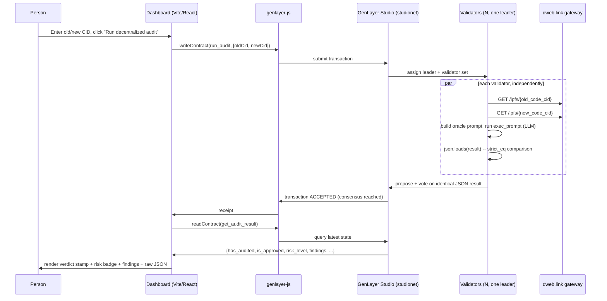

# Architecture

End-to-end flow from a person typing two IPFS CIDs into the dashboard to a
stamped verdict landing back on screen.

## Why consensus is strict here

GenLayer's `gl.eq_principle.strict_eq` requires every validator's
independently-computed result to match **exactly** before a transaction is
accepted. For most non-deterministic tasks (e.g. summarizing a webpage)
teams use a looser equivalence principle, because near-misses are fine. For
a security verdict, a near-miss is the failure mode you're trying to avoid —
so this contract intentionally uses the strict variant. In practice this
means: if validators' LLM calls return materially different JSON (different
`risk_level`, different `findings`), the transaction does not reach
consensus rather than silently picking one validator's answer.

## Why one audit per deployment

`has_audited` is checked once and never reset. Two reasons:

1. **Non-repudiation.** A verdict you can keep re-running until it says what
   you want isn't a verdict — it's a slot machine. One contract instance =
   one immutable record, addressable forever at its deployment address.
2. **It maps cleanly onto how upgrades actually happen.** A real upgrade
   decision is a single event (ship it or don't), so the audit record should
   be too. Auditing a second upgrade later is a second deployment, not a
   second call.

## Trust boundaries, explicitly

| Boundary | What's trusted | What isn't |
|---|---|---|
| IPFS fetch | The `dweb.link` gateway returns the same bytes for a given CID to every validator | The gateway itself isn't a validator — if it serves stale/different content, validators may disagree and consensus simply fails closed |
| LLM judgment | The model can reason usefully about a code diff when given clear instructions and forced into structured output | The model is not a formal verifier; treat "Approved" as a strong signal, not a proof |
| Contract logic | `is_approved` is derived by ordinary, auditable Python from the model's own structured fields — not by the model itself | None of the contract's deterministic logic depends on trusting the model's *prose*, only its three structured fields |

See [`contracts/README.md`](../contracts/README.md) for the contract's
method-level documentation, and [`SECURITY.md`](../SECURITY.md) for how
these limitations relate to actually shipping an upgrade.
